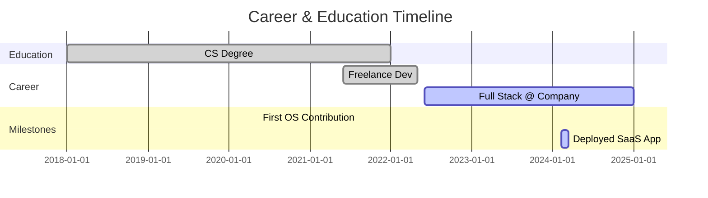

<!-- HEADER & TYPING ANIMATION -->

  

<!-- SOCIALS / CONNECT -->

  
  
  

 

<!-- INTRO & BIO -->

  <h3>🚀 About Me</h3>
  

    I am a Full Stack Developer based in <b>Egypt</b> 🇪🇬. I build accessible, pixel-perfect, and performant web applications.
     
    Currently hacking on <b>System Architecture</b> and learning <b>DevOps Scaling</b>.
  

---

<!-- 🕹️ THE PHYSICS ENGINE (SNAKE GAME) -->
<!-- This links to the file generated by snake.yml -->

  <h3>🐍 My Contribution History</h3>
  

---

<!-- 🧠 TECH STACK (ANIMATED ICONS) -->

  <h3>🧠 The Neural Network</h3>
  <a href="https://skillicons.dev">
    
      
    
      
    
  </a>

---

<!-- 🌇 THE 3D CITY (METRICS) -->
<!-- This links to the file generated by metrics.yml -->

  <h3>📊 GitHub Analytics</h3>
  

---

<!-- ⏳ CAREER TIMELINE (MERMAID JS) -->
### ⚡ My Journey

---

<!-- 💻 HARDWARE SETUP (INTERACTIVE DROPDOWN) -->
### 💻 Battle Station

<b>Click to reveal my Gear ⚙️</b>

 

| Component | Specs |
| :--- | :--- |
| **OS** | Windows 11 / Linux (Ubuntu) |
| **CPU** | Intel Core i7 |
| **RAM** | 32GB DDR4 |
| **Editor** | VS Code (Theme: Tokyo Night) |

---

<!-- 🌍 PLACES & TRAVEL -->
### 🌍 Global Footprint

  
<b>Places I've Lived or Deployed From:</b>

  
  
  
   
  
  <!-- LOCAL TIME EGYPT -->
   
  

---

<!-- 🏆 ACHIEVEMENTS & TESTIMONIALS -->

  <h3>🏆 Achievements</h3>
  <!-- 3D TROPHIES -->
  

  <!-- SCROLLING TESTIMONIALS -->
    
  

---

<!-- 🤝 COMMUNITY -->

  <h3>🤝 My Network</h3>
  

---

<!-- FOOTER & STATS -->

  
   
  
    
  <!-- RANDOM JOKE -->
  

