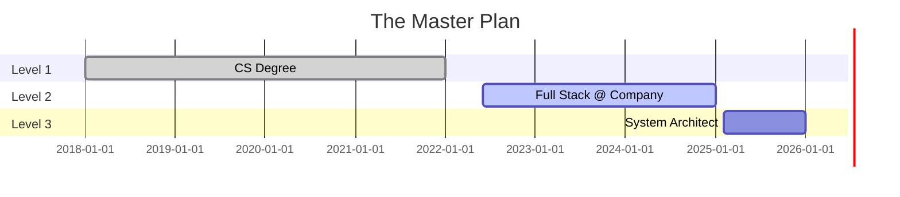

<!-- HEADER: VS CODE STYLE TERMINAL -->
<div align="center">
  
</div>

<!-- BIO: JSON INTERFACE -->
```typescript
interface Developer {
    username: "BadrHassanTRW";
    location: "Cairo, Egypt 🇪🇬";
    role: "Full Stack Architect";
    status: "Building Digital Empires";
    drink: "Coffee.black()";
}
```

<!-- SECTION 1: THE ARCHITECTURE (3-COLUMN TABLE) -->
<table align="center" width="100%">
  <tr>
    <td align="center" width="33%">
        <b>✨ The Frontend (UI)</b><br/><br/>
        
    </td>
    <td align="center" width="33%">
        <b>🧠 The Core (Me)</b><br/><br/>
        <a href="https://linkedin.com/in/YOUR_LINKEDIN"></a><br/>
        <a href="https://YOUR_PORTFOLIO"></a><br/>
        <br/>
        <!-- LIVE CAIRO CLOCK -->
        <a href="https://time.is/Cairo">
          
        </a>
    </td>
    <td align="center" width="33%">
        <b>⚙️ The Engine (Backend)</b><br/><br/>
        
    </td>
  </tr>
</table>

<br/>

<!-- SECTION 2: THE "UNPOPULAR OPINIONS" MARQUEE (The Personality) -->
<div align="center">
  <a href="https://git.io/typing-svg">
    
  </a>
</div>

---

<!-- SECTION 3: HUMAN METRICS (The 3 Stats) -->
### 🧬 The Human Stats
<div align="center">
  
  
  
</div>

---

<!-- SECTION 4: 3D CITY METRICS (Direct Raw Link) -->
<div align="center">
  <h3>🏙️ System Architecture (Activity)</h3>
  
</div>

---

<!-- SECTION 5: SNAKE GAME -->
<div align="center">
  <h3>🐍 The Code Stream</h3>
  
</div>

---

<!-- SECTION 6: CAREER TIMELINE -->
### ⚡ Execution Plan


<!-- FOOTER -->
<div align="center">
 
</div>
