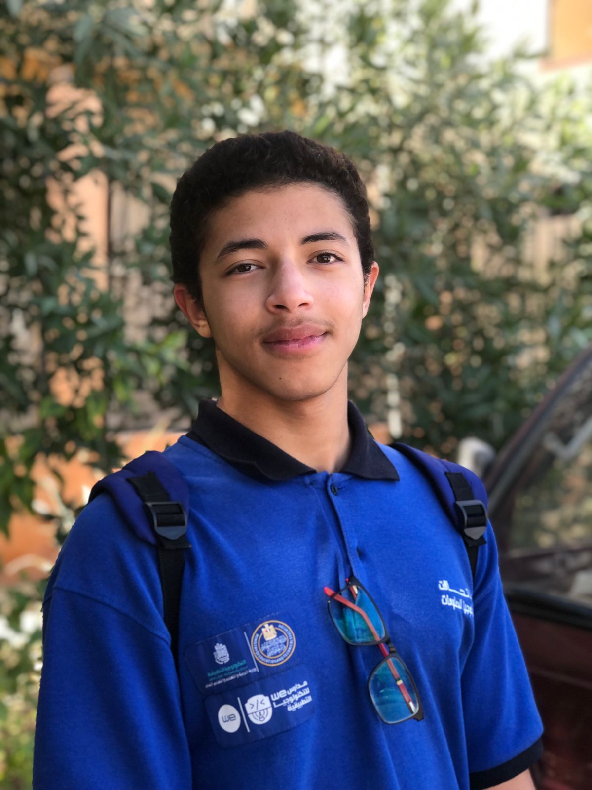

<!-- 1. HERO SECTION (THE SEO ENGINE) -->
<div align="center">
  <!-- SEO PFP: Ensure your file is named badr-git-profile.jpg in this repo -->
  
  
  <h1>Badr Hassan</h1>
  <h3>Full Stack Engineer | Creator of Badr AG (AI Agent)</h3>

  <!-- Typing Header -->
  <a href="https://github.com/BadrHassanTRW">
    
  </a>
</div>

```typescript
interface Developer_Profile {
    name: "Badr Hassan";
    alias: "Badr Git";
    role: "Full Stack Dev & Student Entrepreneur";
    origin: "Cairo, Egypt";
    focus: "Badr AG (Agentic AI Framework)";
    status: "Winning Hackathons 🏆";
}
```

<!-- 2. GITHUB ANALYTICS (RADICAL THEME) -->
<div align="center">
  
  
</div>
<br/>

<!-- 3. SKILLS & CONNECT TABLE -->
<table align="center" width="100%">
  <tr>
    <td align="center" width="33%">
        <b>✨ The Frontend</b><br/><br/>
        
    </td>
    <td align="center" width="33%">
        <b>🧠 Connect with Badr</b><br/><br/>
        <!-- UPDATED LINKEDIN URL -->
        <a href="https://www.linkedin.com/in/badr-hassan-git/">
            
        </a>
        <br/><br/>
        <a href="https://YOUR_PORTFOLIO_URL_HERE.com">
            
        </a>
        <br/><br/>
        <a href="https://time.is/Cairo">
          
        </a>
    </td>
    <td align="center" width="33%">
        <b>⚙️ The Engine</b><br/><br/>
        
    </td>
  </tr>
</table>

<!-- LEARNING QUEUE -->
<div align="center">
  <br/>
  <b>📥 Pending System Updates (Learning Queue)</b>
  <br/><br/>
  
</div>

<br/>

<!-- 4. TEXT ANIMATIONS (OPINIONS) -->
<div align="center">
  <a href="https://github.com/BadrHassanTRW">
    
  </a>
</div>

---

<!-- 5. SNAKE GAME -->
<div align="center">
  <h3>🐍 Badr's Code Stream</h3>
  
</div>

---

<!-- 6. SYSTEM LOGS (RECENT ACTIVITY) -->
### 📜 Badr Hassan System Logs (Recent Activity)

```bash
[SUCCESS] 🥇 WINNER: Youth in Lead Competition
          > Ranked 1st out of 37 Teams
          > Project: "Badr AG" (AI-Powered Agentic Assistant)

[DEPLOY]  🚀 ISEF Competition
          > Advanced through 3 phases with AG AI Project.
          > Focus: STEM Research & Innovation by Badr Hassan.

[NETWORK] 📡 Google DevFest & Cairo ICT 2024
          > Explored Deep Learning & UI/UX Trends.
          > Connected with industry leaders in Egypt.

[UPDATE]  🌱 Sustainability Patch
          > Project: "PTO Green House" (Presented at AIS).
          > Status: Completed School Representation.
```

---

<!-- 7. HUMAN STATS -->
### 🧬 Human Stats
<div align="center">
  
  
  
</div>

<!-- 8. EXTREME HIDDEN SEO (DO NOT REMOVE) -->
<div style="display:none;" aria-hidden="true">
  <h1>Badr</h1>
  <h2>Badr Hassan</h2>
  <h3>Badr Git</h3>
  <p>Badr Hassan is a software engineer and AI developer from Cairo, Egypt. This is the official Badr Git GitHub profile. Badr Hassan specializes in Full Stack Web Development, React, Python, and the AG AI Agent. Winner of Youth in Lead. Student at We School for Applied Technology. BadrHassanTRW profile.</p>
</div>
